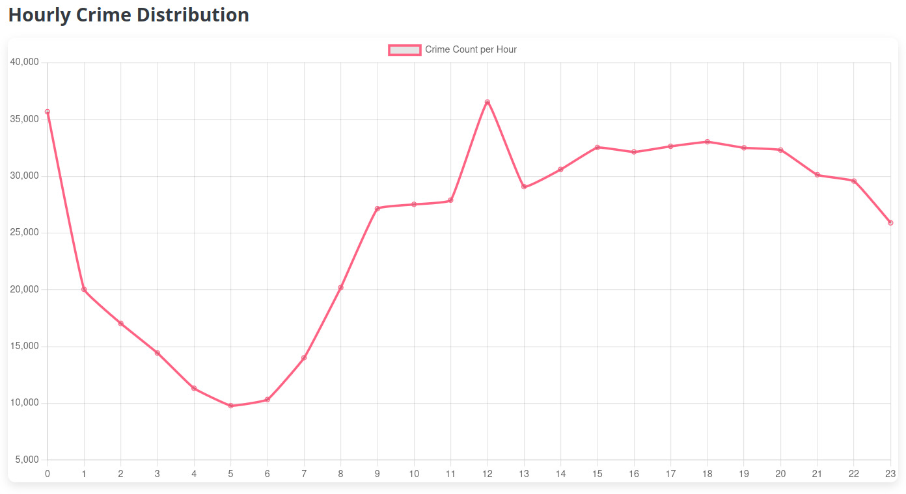
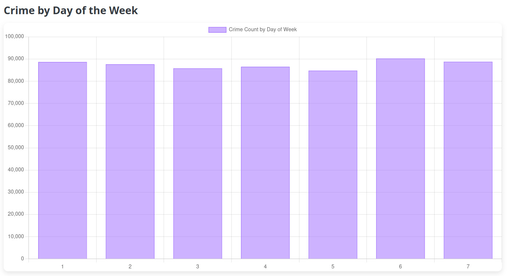
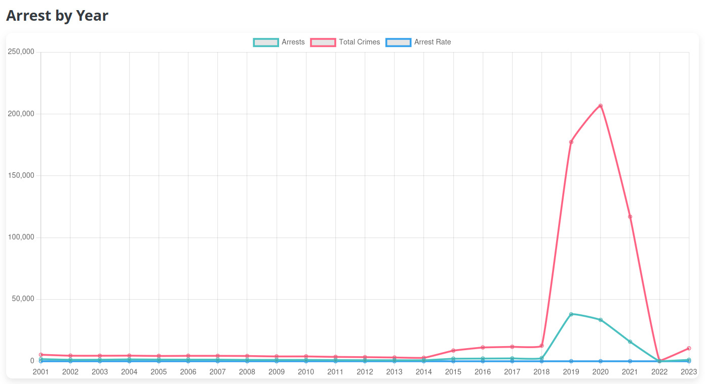
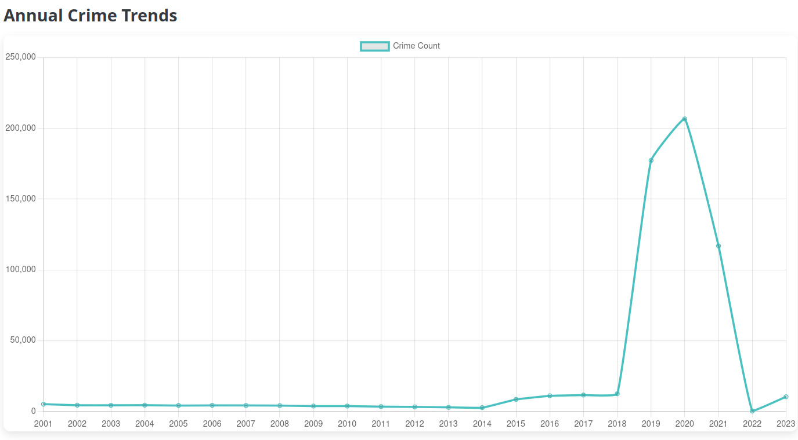
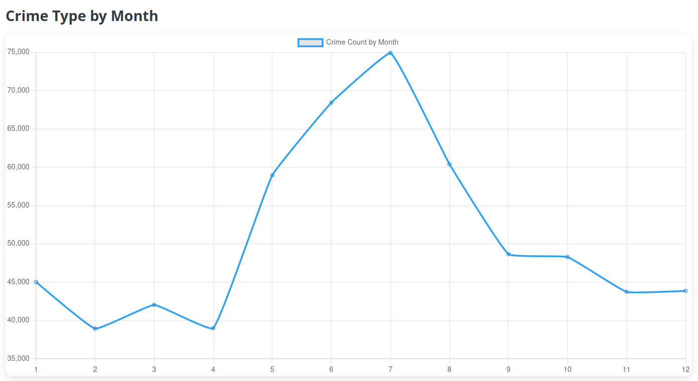

# What is our Application?
1. **Introduction to the Application**:  
   We are building a Flask-based web application to process, analyze, and visualize crime data. The app includes both front-end routes (for rendering HTML pages) and back-end API endpoints (for serving data in JSON format). This system serves as a platform to interact with multiple datasets, derive insights, and query specific information related to crime trends.

2. **Loading Datasets**:  
   We load multiple CSV files containing structured data into **Pandas DataFrames**. These datasets likely represent **big data insights** collected over time (e.g., crime trends, community-specific risks, arrest rates, etc.). Pandas provides powerful tools to process and filter the datasets efficiently, making it easier to analyze even moderately large datasets. However, for truly massive datasets, tools like Spark or Dask could be considered for distributed processing.

   - Examples of datasets loaded include:
     - `annual_trends.csv`: Annual patterns in crime.
     - `arrest_rate_crime.csv`: Arrest rates linked to crime.
     - `Final_Prediction.csv`: A dataset containing crime risk predictions for various community areas.

   By handling this data programmatically, we prepare it for visualization, query, and analytics, which are critical in **big data applications**.

3. **Web Application Functionality**:  
   - **Homepage (`/`)**:  
     We direct users to the main dashboard or visualization page for easy navigation. The visualizations provide an interactive way to explore **aggregated insights** from the data, which is a hallmark of big data analytics.
   
   - **Visualizations Page (`/visualisations`)**:  
     Here, we would display interactive charts or graphs (likely rendered using JavaScript libraries like D3.js, Plotly, or Chart.js) to help users interpret trends such as crime by day, month, type, or hour.

4. **Query Functionality (`/query`)**:  
   This route enables users to **query the risk level** of a specific community area by entering its ID.  
   - We handle user input, validate it (ensuring it's an integer), and filter the `Final_Prediction` dataset based on the input.
   - If a match is found, we extract the **Risk_Level** for that community area and render it on the query page.
   - This is an example of leveraging **predictive analytics** from big data to provide actionable insights.

   Error handling is built in to ensure a smooth user experience, such as messages for invalid input or when no data is found.

5. **API Endpoints**:  
   We provide several RESTful API endpoints to make the processed data available for programmatic access. This is a standard approach in big data systems to expose results or summaries to other applications or users.

   - **Data APIs**: Endpoints like `/api/annual_trends`, `/api/arrest_rate_crime`, etc., serve data directly in **JSON format**, allowing it to be integrated with external systems for further analysis.
   - **Prediction Query API (`/api/query`)**:  
     We expose an API endpoint to query crime risk predictions programmatically. By passing a `community_area` as a query parameter, the endpoint returns the associated **Risk_Level**. This makes the system highly extensible, as external apps or analytics pipelines can consume this data.

6. **Connection to Big Data**:  
   - **Data Volume**: Handling datasets like crime trends and predictions can become computationally intensive, especially for large cities. While we're using Pandas here, scaling to larger datasets might require distributed systems like Apache Spark or cloud-based big data solutions.
   - **Data Variety**: The datasets represent multiple dimensions (temporal, geographic, categorical data, etc.), which is characteristic of big data.
   - **Data Insights**: The predictions (e.g., community risk levels) reflect **machine learning applications**, where big data is used to train predictive models and provide actionable insights.

7. **Running the Application**:  
   When we run the app, Flask acts as a web server to handle requests. Running it in `debug` mode allows us to test and debug efficiently during development.

In essence, we are combining **web development, data processing, and predictive analytics** to create a user-friendly platform for crime data insights. This is an excellent demonstration of how big data systems can drive smarter decision-making through interactive tools and APIs!

# How are we handling big data?

## Big Data Crime Analysis and Clustering

Continuing from the previous application of our crime analysis web application, this code takes a **big data approach** to analyze urban crime patterns and predict high-risk areas using **Apache Spark**, a distributed data processing framework. Here's what we are doing step by step:

### **Step 1: Spark Session Initialization**
- **What are we do**: Initialize a Spark session naminged `"Urban Crime Analysis"`. This serves as the entry point for our Spark application, allowing distributed data processing.
- **Big Data Connection**: We connect to **HDFS (Hadoop Distributed File System)**, where the crime dataset (`Crimes_-_2001_to_Present.csv`) is stored. This ensures scalability for handling large volumes of data.

### **Step 2: Data Loading and Initial Inspection**
- **What are we doing**:
  - Load the dataset from HDFS into a Spark DataFrame, enabling distributed processing.
  - Display the schema and first few rows to understand the dataset structure and initial content.
- **Big Data Connection**: Spark's ability to infer schema automatically from the data helps us work efficiently with datasets too large for memory.

### **Step 3: Data Cleaning**
- **What are we doing**:
  - Check for missing values in the dataset.
  - Drop rows missing critical information such as `"Primary Type"`, `"Date"`, `"Latitude"`, and `"Longitude"`.
- **Big Data Connection**: Cleaning data in Spark ensures we only process relevant and complete records, optimizing downstream analysis on large datasets.

### **Step 4: Data Transformation**
- **What are we doing**:
  - Parse the `"Date"` column into a proper timestamp format to extract temporal features like `Year`, `Month`, `DayOfWeek`, and `Hour`.
  - These features enable deeper insights into **temporal crime patterns**.
- **Big Data Connection**: Transforming and enriching the dataset with time-based features at scale is critical for uncovering trends in big data.

### **Step 5: Data Aggregation**
We perform various aggregations to uncover **crime trends**:
1. **Crimes by Community Area**: Identify which areas have the highest crime rates.
2. **Monthly Crime Trends**: Observe how crime frequency varies across months.
3. **Arrest Analysis**: Examine arrests per month and calculate arrest rates by crime type.
4. **Crime Types per Month**: Explore which types of crimes are prevalent in specific months.
5. **Hourly Trends**: Analyze when crimes are most frequent during the day.
6. **Day of Week Trends**: See which days of the week are prone to higher crime rates.
7. **Annual Trends**: Study crime patterns over the years.
8. **Arrest Rates by Year**: Track how the arrest rate changes over time.

- **Big Data Connection**: These aggregations utilize Spark's distributed processing power to compute results across large datasets quickly.

### **Step 6: Clustering for High-Risk Area Prediction**
- **What are we doing**:
  - **Feature Engineering**: Use `"Latitude"` and `"Longitude"` as features to identify geographical crime clusters.
  - **K-Means Clustering**:
    - Apply the K-Means algorithm to group areas into `k=5` clusters.
    - Cluster centers represent geographic areas with distinct crime densities.
    - Label clusters as `"High Risk"` or `"Low Risk"` based on their proximity to crime hotspots.
  - **Clustering Results**: Assign risk levels to community areas, marking high-crime zones.
- **Big Data Connection**: Clustering with Spark scales well for large datasets, helping us perform complex spatial analyses on big data.

### **Step 7: Model Evaluation**
- **What are we doing**:
  - Calculated the **Silhouette Score** to evaluate clustering quality. A higher score indicates better-defined clusters.
  - We got **0.5428** indicating that are clustering lies in between the ideal clustering and indistinct cluster.
- **Big Data Connection**: Using Spark's built-in ClusteringEvaluator ensures we can efficiently assess the clustering model across distributed data.

### **Step 8: Exporting Results for Visualization**
- **What are we doing**:
  - Save aggregated results (crime trends, arrest rates, and clusters) as CSV files back to HDFS for further visualization or integration with tools like Tableau or our Flask web app.
- **Big Data Connection**: By exporting results to HDFS, we ensure compatibility with other components of our big data ecosystem.

## Analysis

## **Key Big Data Highlights**
1. **Scalability**: Spark's distributed computing framework ensures we can handle datasets with millions of rows without performance bottlenecks.
2. **HDFS Integration**: Leveraging HDFS for storage allows efficient distributed reads/writes for large datasets.
3. **Temporal and Spatial Analysis**: By analyzing time-based patterns and clustering spatial data, we uncover actionable insights into urban crime dynamics.
4. **Data Processing Pipeline**: The code builds a complete pipeline from **data cleaning** to **analysis**, **clustering**, and **visualization**, which is ideal for a big data project.

## **How This Complements the Flask Application**
- The **Flask web app** focuses on visualizing results and enabling user interaction (e.g., querying community risk levels).
- The **Spark** processes and analyzes the raw data, producing the outputs consumed by the web app, such as CSVs for trends and clustering.
- Together, they form a **big data-driven crime analysis system**, combining Spark for backend data processing and Flask for frontend visualization and interaction.

# Conclusion
This entire project demonstrates how big data tools and techniques (Spark and HDFS) integrate with modern web technologies (Flask) to create an end-to-end solution for analyzing and visualizing urban crime patterns (a big data problem).
